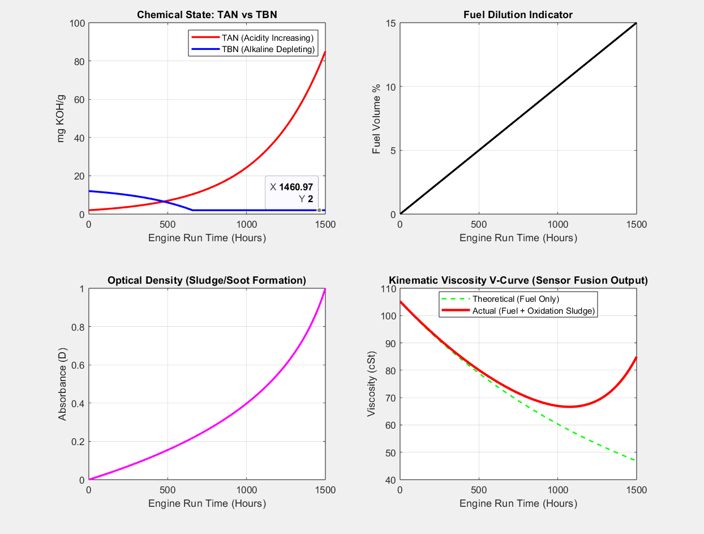
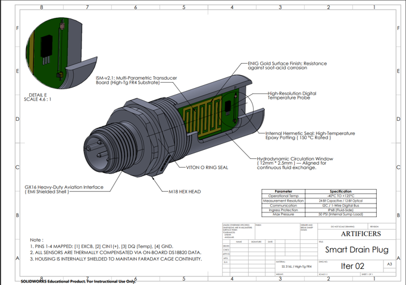
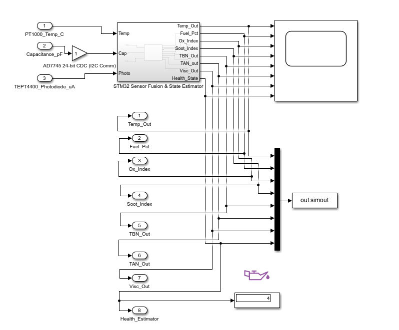
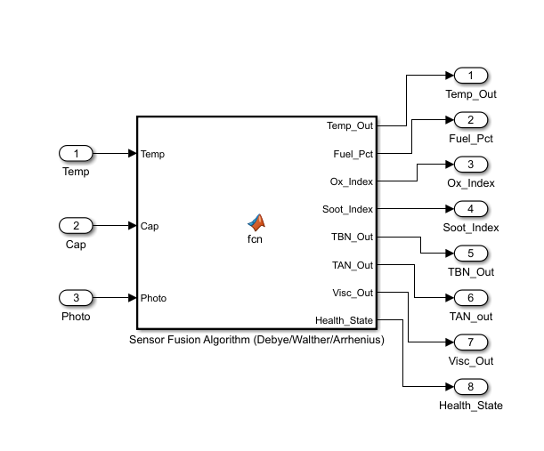

# ISM-P24 — Integrated Sump Monitor Plug (M24)
### Real-Time Engine Oil Condition Monitoring System

---

## The Problem

Engine oil degrades silently. Conventional service intervals are time-based — not condition-based — leading to either premature oil changes (waste) or missed degradation events (engine damage). There is no affordable, retrofittable solution that gives real-time oil health data directly from the sump.

---

## What It Is

ISM-P24 is a **smart drain plug replacement** — an M24 hex-head plug that integrates a multi-parametric oil condition sensor directly into the engine sump, with zero modifications to the engine itself.

It monitors **5 oil health parameters simultaneously** from a single sensor assembly:

| Parameter | Method |
|---|---|
| Temperature | DS18B20 Digital Probe |
| Fuel Dilution (%) | Capacitive dielectric sensing |
| Oxidation Index | Capacitive dielectric sensing (fused) |
| Soot / Sludge Index | 940nm IR optical density |
| TBN (Base Reserve) | Virtual sensing via linear regression |

---

## Working

### Sensor Fusion

Rather than using five separate sensors (expensive, space-consuming), ISM-P24 uses **sensor fusion** — a single capacitive transducer paired with an IR optical pair, with the STM32 MCU deriving all five parameters mathematically.

The core insight: **fuel dilution and oxidation have opposite effects on oil dielectric constant and viscosity**, but they are not chronologically correlated. A naive sensor would confuse the two. We resolve this ambiguity using optical soot density as a tie-breaker — derived from the Beer-Lambert optical density relationship.

### Mathematical Foundation

The fusion algorithm is grounded in established physical models:

- **Debye Formula** — relates dielectric permittivity to polar oxidation products vs. non-polar diesel
- **Arrhenius Equation** — models oxidation rate as a function of temperature (rate doubles per 10°C)
- **Walther Mixing Rule** — models kinematic viscosity of fuel-oil mixtures
- **GM 1,1 Differential Model** — tracks viscosity shift dynamics over engine run-time
- **Linear Regression** — maps TBN depletion from TAN accumulation history

---

## Relation between various oil parameters

<p align="center">
  
  <br>
  <em>Relationship Between variables</em>
</p>
<br>

## General Layout

<p align="center">
  
  <br>
  <em>General Layout</em>
</p>
<br>

---

## Simulink Canvas

<p align="center">
  
  <br>
  <em>Top Layer</em>
</p>
<br>

<p align="center">
  
  <br>
  <em>Sensor Fusion Algorithm</em>
</p>
<br>

## Hardware Architecture

### The Plug

- **Housing:** 316L stainless steel M24 bolt, CNC-bored for sensor cavity and wiring channel
- **Sealing:** Viton O-rings (FKM) + 150°C-rated hermetic epoxy potting
- **Connector:** GX16 4-pin aviation-grade (EMI shielded shell) for external electronics hub
- **Flow slots:** 12mm × 2.5mm hydrodynamic windows for continuous oil exchange across sensors
- **Rating:** -40°C to +125°C operating, IP68 (fluid-side), 50 PSI max sump pressure

### Custom PCB — ISM-v2.1

A custom 2-layer High-Tg FR-4 PCB with ENIG gold finish, designed as a multi-parametric transducer board:

- **Comb-structured Interdigitated Electrode (IDE)** for capacitive oil dielectric measurement
- **AD7745** 24-bit Capacitance-to-Digital Converter (femtofarad precision, I2C)
- **TEPT4400** phototransistor paired with 940nm IR LED for soot optical density
- **DS18B20** waterproof temperature probe for real-time thermal compensation

### Electronics

- **MCU:** STM32F103C8Tx (Cortex-M4, 12-bit ADC, I2C + 1-Wire multi-protocol)
- **Power:** Dual-rail — 5V for IR LED drive (via PN2222A transistor), 3.3V isolated logic rail
- **Signal integrity:** I2C pull-ups, shielded twisted-pair cabling, Faraday cage housing continuity

---

## System Outputs — Health State Engine

The STM32 fusion algorithm outputs an 8-parameter data stream and classifies oil into one of five health states:

```
State 0 — Healthy
State 1 — Fuel Leak Warning (early-stage dilution detected)
State 2 — Heat / Oxidation Warning (running hot or heavy oxidation)
State 3 — Acid Critical (TBN severely depleted, corrosion risk)
State 4 — Sludge Critical (V-curve cancel-out zone — sensor tie-breaker active)
```

---

## Bill of Materials (Summary)

| Category | Key Components | Approx. Cost (INR) |
|---|---|---|
| Electronics | STM32, AD7745, DS18B20, IR pair, GX16 | ~₹2,965 |
| Custom PCB | High-Tg FR-4, 2-layer, ENIG finish | ~₹1,500 |
| Mechanical | 316L bolt, CNC machining, Viton O-rings | ~₹1,380 |
| Sealing & Cabling | High-temp epoxy, shielded cable | ~₹300 |
| **Total** | | **~₹7,295 – ₹7,500** |

Designed and validated to fit within a ₹10,000 project budget.

---

## Expected Outcome

**Retrofittable** — replaces any M24 drain plug, no engine modification needed.  
**Cost-effective** — single capacitive sensor does the work of three, virtual TBN sensing eliminates IR spectroscopy.  
**Industrially robust** — IP68 rated, hermetically sealed, Faraday-shielded, vibration-rated connector.  
**Mathematically grounded** — every derived parameter traces to a validated physical model.


---

